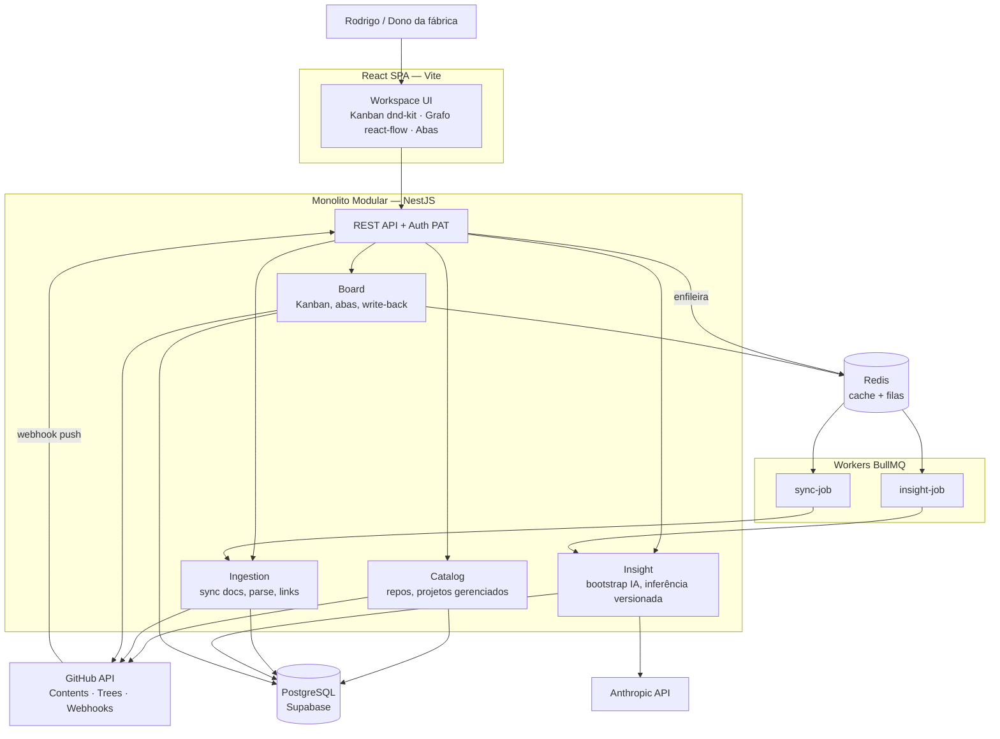

# Arquitetura — RRB ProPlan

Monolito modular NestJS com fronteiras DDD. Cada módulo é candidato a serviço se o produto virar SaaS — a extração é decisão futura, não presente (ADR-001).

## C4 — Nível 2 (Containers)



## Bounded Contexts / Módulos

| Módulo | Responsabilidade | Não faz |
|---|---|---|
| **Catalog** | Conexão GitHub (PAT no MVP), listar repos, marcar repo como "projeto gerenciado", metadados (nome, descrição, última atividade) | Ler conteúdo de arquivos |
| **Ingestion** | Sync incremental de `docs/`, `README.md`, `CLAUDE.md`, `.claude/`, `.github/workflows/` via Trees/Contents API; detectar mudança por `docs_tree_sha`; parse de frontmatter YAML; extrair links MD (relativos + wikilinks) → grafo | Interpretar conteúdo (IA) |
| **Insight** | Bootstrap: gerar MDs da convenção para projeto legado (saída = proposta de commit, dono aprova); inferência de fallback (arquitetura/design/resumo) persistida com `docs_tree_sha`; sugerir arestas semânticas do grafo (marcadas `inferred`) | Chamar IA em request síncrona |
| **Board** | Compor as abas do workspace (mapa aba→fonte em `CONVENTION.md`); Kanban: parse de `STATUS.md` → colunas/cards; mover card → editar MD → commit via Contents API → aguardar webhook | Guardar estado de card fora do MD |
| **Identity** (futuro) | GitHub OAuth, multi-tenant, RBAC | Existir no MVP — PAT único em variável de ambiente |

## Estratégia de dados

| Store | Uso |
|---|---|
| **PostgreSQL** | `projects`, `documents` (metadados + conteúdo parseado + sha), `doc_links` (arestas do grafo: `source`, `target`, `type: explicit\|inferred`), `insights` (artefatos IA: `kind`, `docs_tree_sha`, `content`, `model`), `sync_runs` (auditoria) |
| **Redis** | Filas BullMQ (`sync`, `insight`); cache de composição de abas (invalidado por webhook) |
| **Repo GitHub (alvo)** | Fonte de verdade de `STATUS.md` e todos os docs da convenção |

Sem Kafka no MVP (ADR-004). Sem MongoDB — conteúdo MD parseado cabe em `jsonb`.

## Comunicação

- **Frontend → API**: REST. Mutação de Kanban é assíncrona por natureza (commit + webhook): a API responde `202` com estado otimista; UI reconcilia quando o webhook confirmar (polling do estado do `sync_run` ou SSE).
- **GitHub → API**: webhook `push` (filtrado por paths de docs) dispara sync incremental. Fallback: polling agendado (repos sem webhook configurado).
- **Interno**: chamadas de módulo via services públicos. Eventos de domínio in-process (`@nestjs/event-emitter`) para desacoplar (ex.: `DocsSynced` → invalidar cache + enfileirar insight-job se `docs_tree_sha` mudou).

## Resiliência

- **GitHub rate limit**: cache condicional com ETag; backoff exponencial em 403/429; orçamento de requests por sync.
- **Timeouts** em todos os clients externos (GitHub 10s, Anthropic 120s em job).
- **Circuit breaker** leve (opossum) nos clients GitHub e Anthropic — falha rápida e job re-agendado.
- **Idempotência**: sync e insight-jobs idempotentes por (`project_id`, `docs_tree_sha`); reprocessar é seguro.
- **Conflito de write-back**: commit de card usa SHA base do arquivo; 409 → re-sync, reaplicar mudança, um retry; persiste o conflito → aba mostra "conflito, resolva no repo".
- **Health checks**: liveness/readiness (`@nestjs/terminus`) incluindo Postgres e Redis.

## Estrutura de pastas

```
rrb-proplan/
├── apps/
│   ├── api/            # NestJS
│   │   └── src/modules/{catalog,ingestion,insight,board}/
│   │       └── {presentation,application,domain,infrastructure}/
│   └── web/            # React + Vite
├── docs/
└── docker-compose.yml
```
