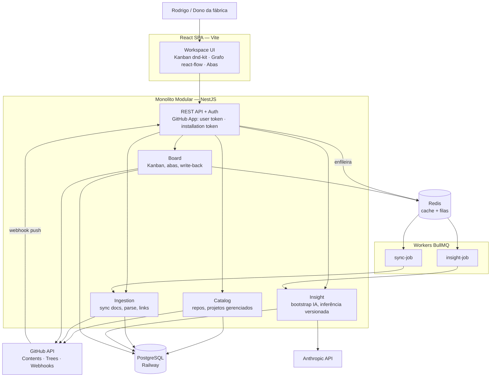

# Arquitetura — RRB ProPlan

Monolito modular NestJS com fronteiras DDD. Cada módulo é candidato a serviço se o produto virar SaaS — a extração é decisão futura, não presente (ADR-001).

## C4 — Nível 2 (Containers)



## Bounded Contexts / Módulos

| Módulo | Responsabilidade | Não faz |
|---|---|---|
| **Catalog** | Listar repos **onde o GitHub App está instalado** (ADR-015), marcar repo como "projeto gerenciado", metadados (nome, descrição, última atividade), estado `sem-instalação` | Ler conteúdo de arquivos |
| **Ingestion** | Sync incremental de `docs/`, `README.md`, `CLAUDE.md`, `.claude/`, `.github/workflows/`, `.proplan/config.yml` via Trees/Contents API; detectar mudança por `docs_tree_sha`; parse de frontmatter YAML; extrair links MD → grafo; **`DocumentResolver` (ADR-014): resolver e persistir a fonte de cada entidade — níveis 1, 2 e 4, determinísticos**; **classificar `kind` por extensão — markdown baixa+persiste; binário grava só metadado e é servido sob demanda (stream efêmero) pelo `/documents/raw`** | Interpretar conteúdo (IA) — o nível 3 da escada é do `insight`; **persistir bytes de binário** |
| **Insight** | Bootstrap (proposta de commit, dono aprova); inferência de fallback (arquitetura/design/resumo) persistida com `docs_tree_sha`; arestas semânticas (`inferred`); **nível 3 da escada do ADR-014** (classificação semântica de documento, gravada no mesmo store de resolução, `source: 'inference'` — **perde** para config e alias) | Chamar IA em request síncrona; sobrescrever resolução vinda do `.proplan/config.yml` |
| **Board** | Compor as abas a partir da resolução **já persistida** pelo `ingestion` (`IngestionService.resolutionOf`); Kanban sobre **GitHub Issues** (ADR-011): mover card → trocar label / fechar issue via Issues API; gerar e commitar a projeção `.proplan/STATUS.md` | Guardar estado de card como fonte (a tabela `issues` é cache); escrever qualquer artefato gerado dentro de `docs/` |
| **Identity** | **GitHub App** (ADR-015): login por OAuth do App → `userToken` (**todas as leituras**); JWT RS256 → `installationToken` cacheado (**todas as escritas**, identidade `proplan[bot]`). Multi-tenant e RBAC na Fatia 8 | Deixar leitura usar installation token (vazaria repos que o usuário logado não enxerga) |

## Estratégia de dados

| Store | Uso |
|---|---|
| **PostgreSQL** | `projects`, `documents` (metadados + conteúdo parseado + sha), `doc_links` (arestas do grafo: `source`, `target`, `type: explicit\|inferred`), `insights` (artefatos IA: `kind`, `docs_tree_sha`, `content`, `model`), `sync_runs` (auditoria) |
| **Redis** | Filas BullMQ (`sync`, `insight`); cache de composição de abas (invalidado por webhook) |
| **Repo GitHub (alvo) — `docs/`** | Fonte de verdade de **todos os docs** da convenção. **Só conteúdo humano** — nada gerado pelo ProPlan entra aqui (ADR-011) |
| **Repo GitHub (alvo) — `.proplan/`** | Tudo que é do ProPlan, commitado no repo-alvo: `.proplan/STATUS.md` (projeção do board — gerado) e `.proplan/config.yml` (mapeamento de documentos — ADR-014, confirmado pelo humano). Fora de `docs/` para não contaminar o frescor do ADR-010 |
| **GitHub Issues (alvo)** | **Fonte de verdade do estado do trabalho** (ADR-011): coluna = label `proplan:*`. **Feito = `open` + `proplan:done`** (entregue, aguardando aceite); **Finalizado = `closed` + `proplan:finalizado`**; Descartado = `closed` + `proplan:descartado`. **A issue só fecha no aceite.** Tabela `issues` no Postgres é cache derivado |

Sem Kafka no MVP (ADR-004). Sem MongoDB — conteúdo MD parseado cabe em `jsonb`.

## Comunicação

- **Frontend → API**: REST. Mutação de Kanban é assíncrona por natureza (commit + webhook): a API responde `202` com estado otimista; UI reconcilia quando o webhook confirmar (polling do estado do `sync_run` ou SSE).
- **GitHub → API**: webhook `push` (filtrado por paths de docs) dispara sync incremental. Fallback: polling agendado (repos sem webhook configurado).
- **Interno**: chamadas de módulo via services públicos. Eventos de domínio in-process (`@nestjs/event-emitter`) para desacoplar (ex.: `DocsSynced` → invalidar cache + enfileirar insight-job se `docs_tree_sha` mudou).

## Resiliência

- **GitHub rate limit**: cache condicional com ETag; backoff exponencial em 403/429; orçamento de requests por sync.
- **Timeouts** em todos os clients externos (GitHub 10s, Anthropic 120s em job).
- **Circuit breaker** leve (opossum) nos clients GitHub e Anthropic — falha rápida e job re-agendado.
- **Idempotência**: o **sync** é idempotente por (`project_id`, `docs_scope_hash`). Os **insight-jobs** passaram a ser idempotentes por (`project_id`, `kind`, `input_hash`) — o hash do prompt efetivamente enviado ao provedor (Fatia 7.7 / SPEC-011, emenda ao ADR-002): uma inferência só regenera quando o que **ela consome** muda, não quando qualquer coisa em `docs/` muda. Cache-hit registra `InsightRun reused` e não chama o provedor; reprocessar é seguro e barato.

  > **Equivalência histórica de nomes** (Decisão 3 da SPEC-011): `Insight.docs_tree_sha` foi renomeado para `docs_scope_hash` — é o **mesmo valor** que `Project.docs_scope_hash`, com dois nomes por acidente histórico; agora unificado. As menções a `docs_tree_sha` neste documento e nas specs/ADRs anteriores à 7.7 referem-se ao atual `docs_scope_hash`. Após a 7.7, ele é **metadado** do artefato ("gerado quando a árvore era X" — insumo do drift no MVP2), não mais a chave de invalidação do insight.
- **Conflito de write-back**: commit de card usa SHA base do arquivo; 409 → re-sync, reaplicar mudança, um retry; persiste o conflito → aba mostra "conflito, resolva no repo".
- **`noop` nunca pode vir de leitura obsoleta** (regra de 2026-07-13). A **Git Trees API do GitHub tem consistência eventual**: por alguns segundos após um commit, `listTree` ainda serve a árvore **anterior**. Todo write-back do ProPlan é seguido de um re-sync imediato (bootstrap, promote, `.proplan/config.yml`, projeção `.proplan/STATUS.md`) — e um re-sync que lê a árvore velha calcula o **mesmo hash**, grava **`noop`**, e a mudança recém-commitada **não é ingerida**.

  **Por que isto é grave, e não é dívida técnica comum**: `noop` é o mecanismo com que o produto decide *"nada mudou"*. Um `noop` falso é o ProPlan **afirmando com autoridade que a documentação está igual quando ela acabou de mudar** — num produto cuja tese inteira é *"eu sei quando a doc está mentindo"*. É o produto mentindo no seu mecanismo central.

  **Regra**: o write-back devolve o **SHA do arquivo commitado** (a Contents API entrega `content.sha` — o blob SHA). O `enqueueSync` recebe `{path, blobSha}` (persistido em `SyncRun.expectPath/expectBlobSha`) e o sync **só pode declarar `noop` depois de confirmar que a árvore lida já contém aquele blob naquele path**. Não contém → espera e repete (backoff curto, teto de 3 tentativas), nunca decide; estourou o teto → segue com a árvore que tem e o próximo sync natural corrige (sem perda). Implementado em `SyncService.listScope`.

  **Blob SHA, não commit SHA** (divergência da 1ª redação desta regra, revalidada 2026-07-13): a 1ª redação pedia `expectCommitSha` por analogia genérica ("o commit propagou"). Na mecânica real do sync, o blob é a prova **mais forte e mais barata**:
  - **Mais forte**: o blob SHA é conteúdo-endereçado (`sha = hash(conteúdo)`). Se a árvore serve `path` com o blob SHA commitado, é **garantido** que aquele arquivo já tem exatamente o conteúdo escrito — zero falso positivo. Commit SHA prova "o repo avançou até X"; blob SHA prova "**o arquivo que me importa** propagou", que é mais estreito e é o que o noop precisa.
  - **Mais barata**: o `putFile` já devolve `content.sha` e o `listTree` já entrega `(path, blobSha)` por item — a validação usa dados na mão. Commit SHA custaria +1 request por tentativa de poll (o `listTree` usa ref name e não expõe o commit SHA da árvore servida) para provar algo mais fraco.

  **Condição que obriga a rever**: hoje `promote` e `putMapping` commitam **um arquivo cada** → expectativa singular `{path, blobSha}` cobre 100%. Se um write-back futuro passar a commitar **N paths atômicos** e o noop depender de todos propagarem, a expectativa vira **lista** `[{path, blobSha}]` e o `satisfied()` checa `.every()`. Barato de estender (campo já opcional); não feito agora por YAGNI.

  **Proibido**: `sleep` de duração fixa antes do re-sync. Número mágico não é prova — troca uma condição de corrida por uma aposta, e falha no p99. Todos os call sites de write-back (`promote`, `putMapping`) passam a expectativa `{path, blobSha}` via `enqueueSync`; nenhum dorme.
- **`status` do `SyncRun` é o sinal de "pode recarregar a tela"** (regra de 2026-07-16). O cliente polla o run e, ao vê-lo `success`/`noop`, recarrega a aba — então **tudo que a tela vai ler tem de estar pronto antes do status final**. O `SYNC_COMPLETED` (que dispara o `syncIssues`) era emitido **depois** do `finish`, sem `await`: o front lia o board enquanto as issues ainda iam sincronizar, e o card só aparecia na coluna certa depois de um F5. Agora o emit é `emitAsync` e vem **antes** do `finish`, nos dois caminhos (`success` e `noop`).

  **Por que também no `noop`**: `noop` diz *"os docs não mudaram"* — e as **issues** podem ter mudado. Mover um card direto no GitHub não toca `docs/`, então o caminho `noop` é justamente onde o bug aparecia mais.

  **O que fica fora**: `DOCS_SYNCED` continua `emit` fire-and-forget **depois** do `finish` — ele dispara os jobs de IA, assíncronos por contrato (ADR-002, nunca no caminho de uma request). Esperar por eles seguraria o sync por minutos. A régua é: **espera o que a tela lê ao recarregar; não espera o que roda em job.**

  Custo medido: o `syncIssues` são 2 chamadas ao GitHub (`issuesEnabled` + `listIssues`) — o sync já espera por muito mais (Trees API, downloads, deploy, CI). O listener segue tolerante a falha: Issues desabilitada ou fora do ar não derruba o sync de docs.
- **Health checks**: liveness/readiness (`@nestjs/terminus`) incluindo Postgres e Redis.

## Estrutura de pastas

```
rrb-proplan/
├── apps/
│   ├── api/            # NestJS
│   │   └── src/modules/{catalog,ingestion,insight,board}/
│   │       └── {presentation,application,domain,infrastructure}/
│   └── web/            # React + Vite
├── docs/
└── docker-compose.yml
```
